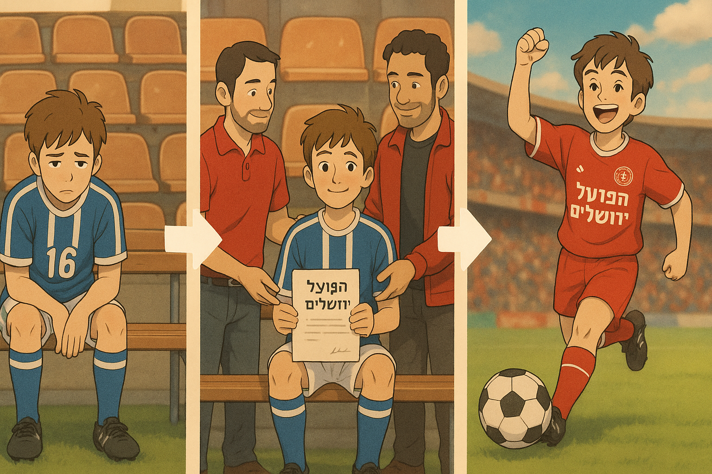

# Hapoel Jerusalem FC – Youth Department Scouting Tool

## About the Project

This project is a scouting and monitoring tool designed to assist the youth department of Hapoel Jerusalem Football Club in identifying promising player prospects.

The tool scrapes data from the Israeli Football Association (IFA) website, processes youth team player statistics, and automatically generates a professional scouting report highlighting players who meet specific criteria.

At the start of the program, the user can choose between three scouting focuses:

1. Rotation-edge players - players on the edge of the squad rotation.  
2. Players playing above their age group - players competing in older age categories.  
3. Top scorers.

---

## Project Goals

- Scrape player data such as minutes played, goals, and squad participation from U15–U19 teams (“Noar”, “Nearim A”, “Nearim B”, “Nearim C”).  
- Analyze and filter players based on well-defined scouting criteria.  
- Allow easy configuration through an external XML configuration file.  
- Build the project in a modular, scalable, and maintainable way.

---

# Scouting Criteria

A potential player is identified if they meet the conditions defined for the selected scouting focus:

### 1. Rotation-Edge Players

**Rotation Position:** Players ranked 12th–18th in the squad based on total minutes in the season.  
**Percentage of Minutes Played:** 25–50% of the minutes compared to the team’s max-minutes player.  
**Participation in Last 3 Matches:** Listed in the squad for at least one of the last three matches, did not start in any of them, and played no more than 90 minutes in total across those matches.

---

### 2. Playing Above Their Age Group

- Played at least 50% of total minutes with a team above their age group.

---

### 3. Top Scorers

- Ranked 5th or higher on the team’s goals leaderboard.

--- 

## Configuration

All parameters are configurable and can be tuned to the preferences and scouting philosophy of the Youth Department Manager – Mr. Lior Houga (e.g., thresholds, ranks, match windows, etc.) via the project’s XML config file.

---

## License
This project is proprietary software.  
**All rights reserved © 2025 Ofek Amsalem.**  
The code is publicly available for viewing purposes only and may not be used, copied, modified, or distributed without explicit permission.
